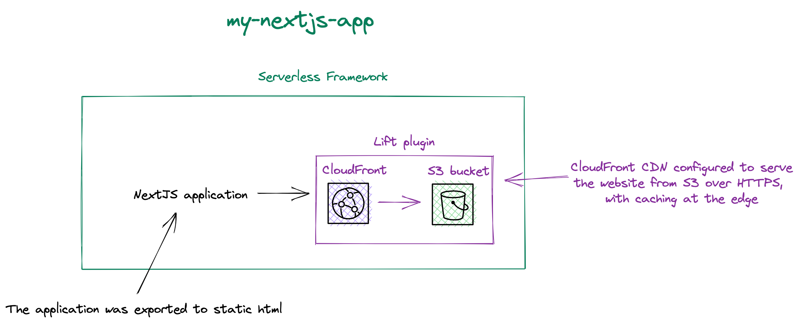
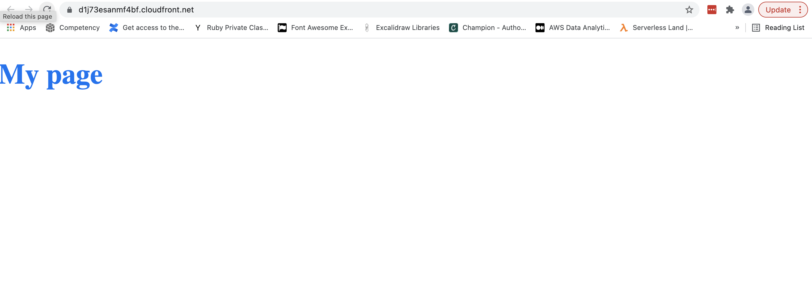

# Serverless AWS NextJS app deployment with Serverless Framework with Lift plugin

This is an example of a deployment of a `NextJS` application exported to `static html`, which will be deployed using the [Serverless Framework](https://serverless.com/) along with the [Lift](https://github.com/getlift/lift)) plugin, which allows you to use [constructs](https://docs.aws.amazon.com/cdk/latest/guide/constructs.html) from the AWS CDK to the Amazon Web Services `cloud`.

 In this particular case, we are using a [static-webiste](https://github.com/getlift/lift/blob/master/docs/static-website.md) construct that performs:
 -  deployment to an S3 bucket.
 -  CloudFront CDN is configured to serve the website from S3 over HTTPS, with caching at the edge.


## Diagram



## Prerequisites

Before the deployment can be executed, we need to prepare `NextJS` application. Follow the instructions in the [Readme](./frontend/README.md) folder `frontend` to build, and export the application to static HTML.

## Setup

`npm install` to install `lift` plugin.

## Deployment

In order to deploy the service run:

```bash
sls deploy
```

for deploying with a specific `profile` (located in `~/.aws/credentials`) you can simply use the command:

```bash
AWS_PROFILE=YOUR_PROFILE_NAME sls deploy
```
The deployment process will take a while.


The expected result should be similar to:

```bash
Serverless: Running "serverless" installed locally (in service node_modules)
Serverless: Packaging service...
Serverless: Creating Stack...
Serverless: Checking Stack create progress...
........
Serverless: Stack create finished...
Serverless: Uploading CloudFormation file to S3...
Serverless: Uploading artifacts...
Serverless: Validating template...
Serverless: Updating Stack...
Serverless: Checking Stack update progress...
..................
Serverless: Stack update finished...
Service Information
service: my-nextjs-app
stage: dev
region: us-east-1
stack: my-nextjs-app-dev
resources: 7
api keys:
  None
endpoints:
  None
functions:
  None
layers:
  None
landing:
  url: https://xxxxxxxxxxxxxx.cloudfront.net
  cname: xxxxxxxxxxxxx.cloudfront.net
Lift: Deploying the static website 'landing'
Lift: Uploading directory 'frontend/out' to bucket 'my-nextjs-app-dev-landingbucket2b5c7526-16knxsqprhttn'
Uploading 404.html
Uploading _next/static/QMCFfC4Sy4SgLRya8KTey/_buildManifest.js
Uploading _next/static/QMCFfC4Sy4SgLRya8KTey/_ssgManifest.js
Uploading _next/static/chunks/framework-92300432a1172ef1338b.js
Uploading _next/static/chunks/main-8f141fd03012b99227c0.js
Uploading _next/static/chunks/pages/_app-67f23dce73c353004520.js
Uploading _next/static/chunks/pages/_error-a0e21b9b223f827fe1f2.js
Uploading _next/static/chunks/pages/index-d64e03af780d35915623.js
Uploading _next/static/chunks/polyfills-a54b4f32bdc1ef890ddd.js
Uploading _next/static/chunks/webpack-715970c8028b8d8e1f64.js
Uploading index.html
Lift: Deployed https://xxxxxxxxxxxxx.cloudfront.net
```

## Usage

After the deployment, you will obtain the link to the deployed website.



## Structure

The repository consists of two parts:

- the frontend folder, where the NextJS application is located.
- application and the main part where you can find files related to Serverless Framework.

## Remove service

To remove the service do:

```bash
sls remove
```
And the stack will be removed from the AWS.